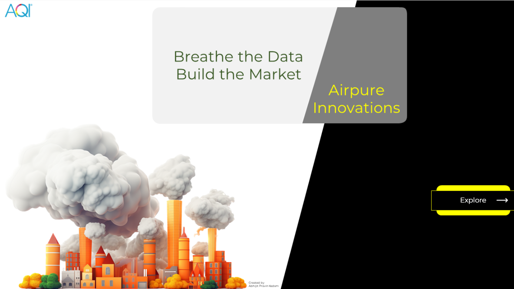
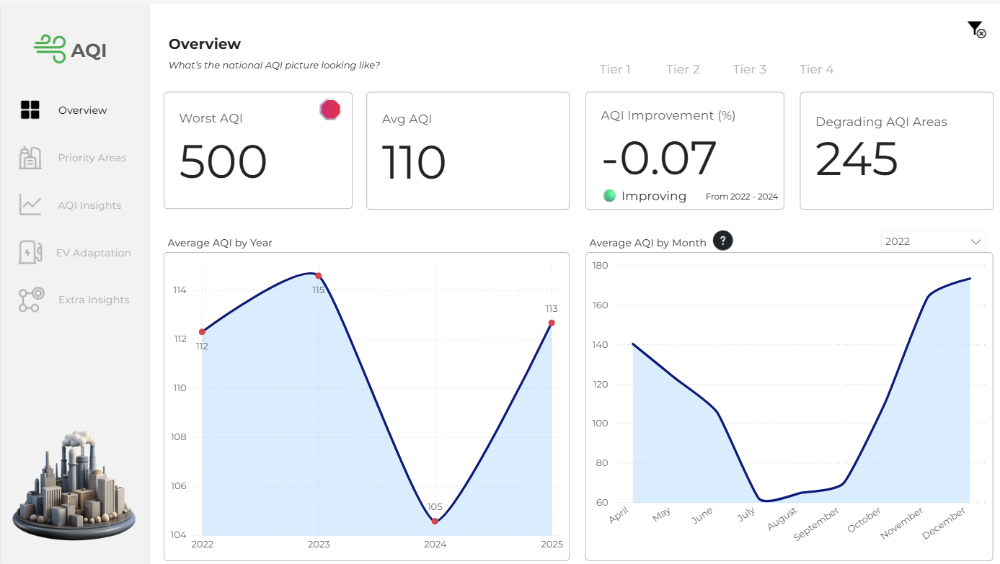
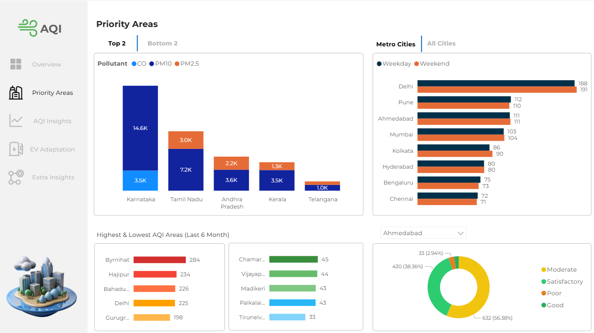
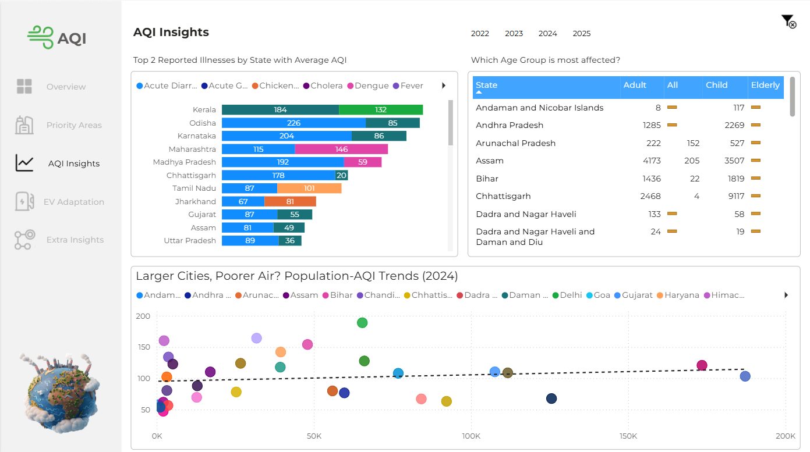
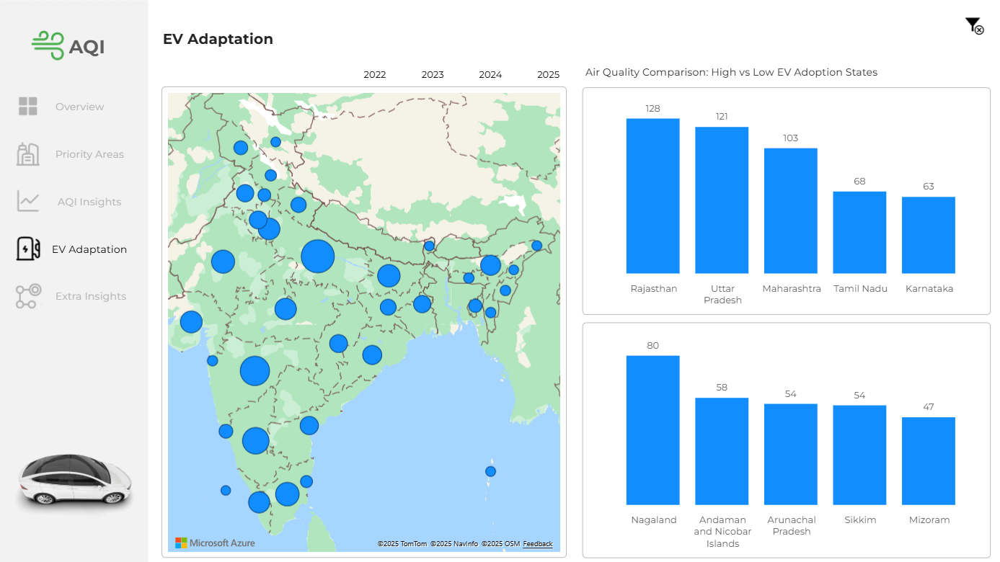
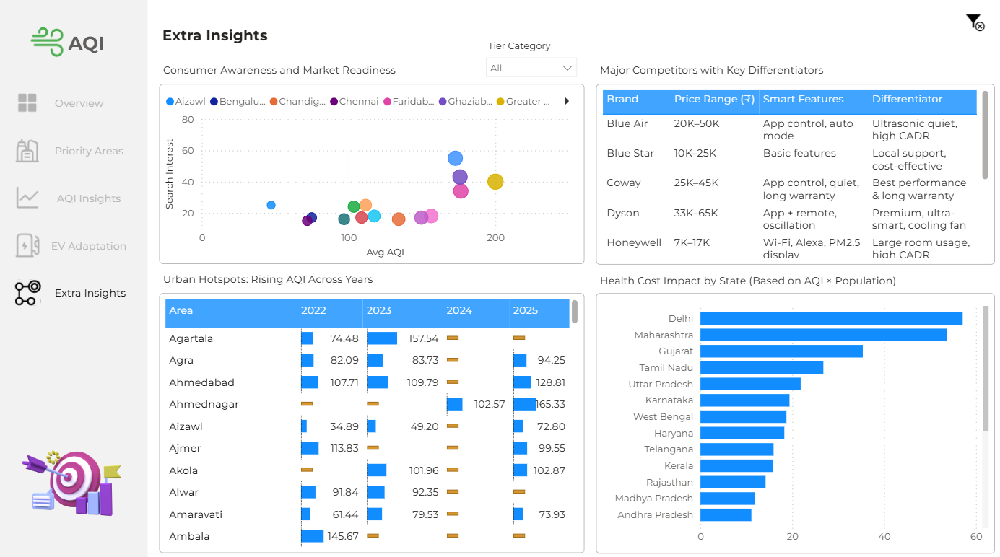

# India AQI Analysis – Power BI Dashboard

## 📌 Overview

This project analyzes India's Air Quality Index (AQI) trends and their connection to health, economy, and EV adoption.  
Using multiple datasets, the dashboard provides insights into:
- National & city-level AQI patterns
- Seasonal and annual trends
- Health impacts by region and age group
- EV adoption trends in high and low AQI states
- Market opportunities for air purifiers

The goal is to turn complex environmental data into actionable insights that can guide policy makers, businesses, and the public.

---

## 📊 Dashboard Pages
1. **Overview**
   - Worst AQI, average AQI, and improvement trends
   - Yearly & monthly AQI patterns

2. **Priority Areas**
   - Top & bottom states by pollutant type
   - Metro city weekday vs weekend AQI
   - Highest & lowest AQI areas (last 6 months)

3. **AQI Insights**
   - Top reported illnesses by state
   - Most affected age groups
   - Relationship between population size and AQI

4. **EV Adaptation**
   - State-wise EV adoption map
   - Air quality comparison in high vs low EV adoption states

5. **Extra Insights**
   - Consumer awareness & market readiness
   - Urban hotspots with rising AQI
   - Competitor analysis for air purifiers
   - Health cost impact by state

---

## 🗂 Datasets Used
- **Air Quality Data** – National AQI monitoring
- **Population Data** – City & state population
- **Health Data** – Disease cases and affected age groups
- **EV Adoption Data** – EV sales and adoption statistics
- **Market Trends Data** – Search interest for air purifiers

*(All datasets are sourced from publicly available government and market research portals.)*

---

## 🛠 Tools & Technologies
- **Power BI** – Data visualization
- **Excel / CSV** – Data preprocessing
- **Canva / Filmora** – Presentation assets (for video demo)

---

## 📷 Dashboard Preview

---

## 📬 Contact
**Author:** Abhijit Kadam  
**LinkedIn:** www.linkedin.com/in/abhijitk47  
**Email:** kadam.abhijitp@gmail.com
